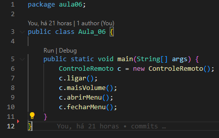
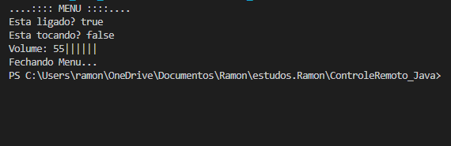

## Código - 🎮 Controle Remoto 📺

### CursoemVídeo - Java POO ☕

Código desenvolvido como resultado da aula 06 do Curso de Java Orientado a Objetos do Curso em Vídeo. Esse programa foi desenvolvido para simular as ações de um Controle Remoto de Televisão. Foi Utilizado <strong>Interface</strong> nesse código e Métodos <strong>Get</strong> and <strong>Setters</strong>.

### Características do Programa 

- [x] O programa vai exibir na tela os atributos da TV, se ela está ligada ou deligada
- [x] Se está tocando ou está em mudo
- [x] O volume pode ser aumentado de 5 em 5 unidades 
- [x] A TV só reproduz caso estiver ligada

  
## Compilação 👨🏽‍💻
### Main - Métodos Personalizados

  

### Preview

  

## Tecnologias 🛠

- Java POO ☕

## Instrutor 👨🏽‍🏫
- <a target="_blank" href="https://www.linkedin.com/in/guanabara/">Gustavo Guanabara</a>

## Aluno 👨🏽‍🎓

- <a target="_blank" href="https://www.linkedin.com/in/ramon-barreto-076191180/">Ramon Barreto</a>

## Contato 📲

- Email: ramon_barreto_medrado@hotmail.com

